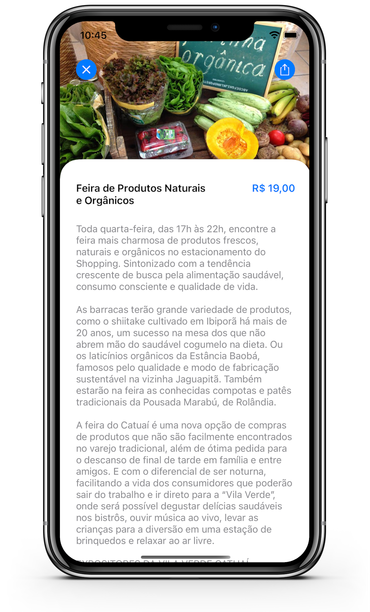
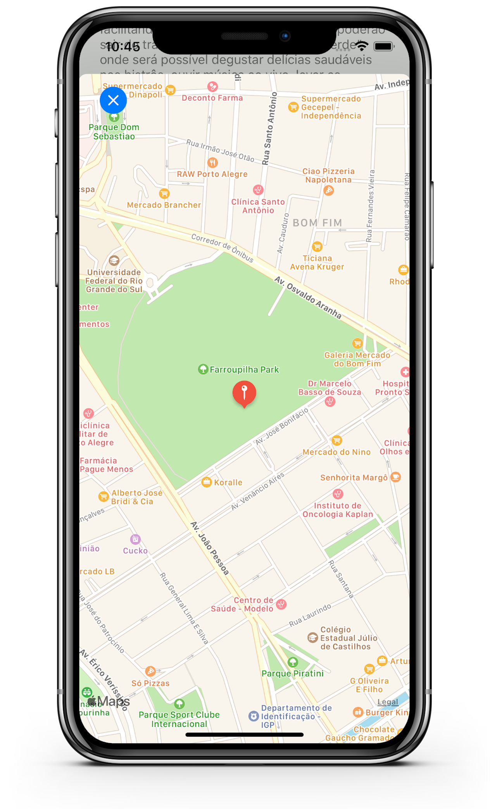
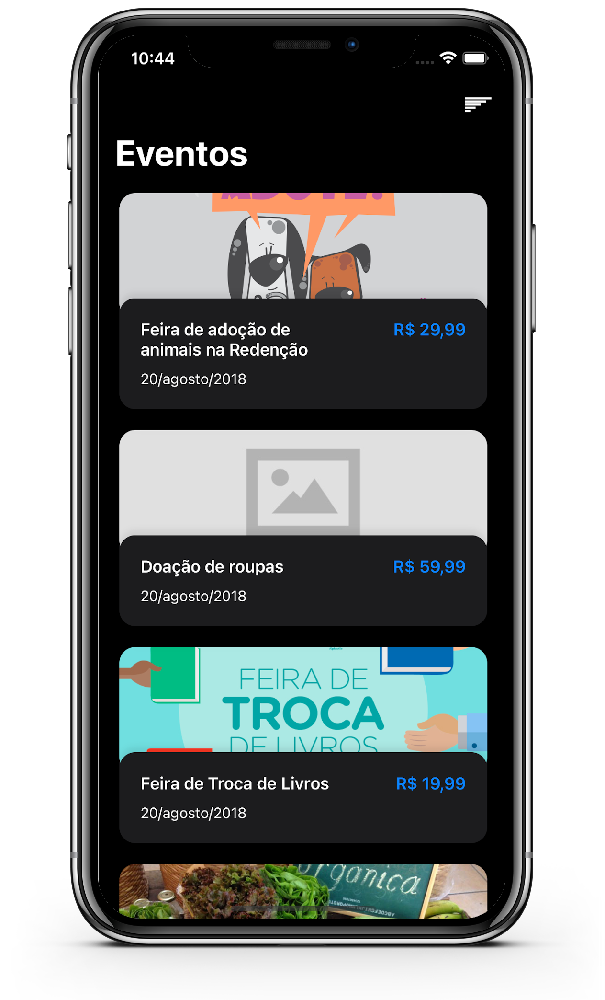
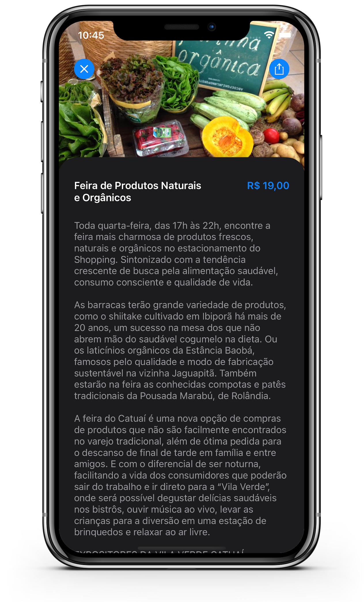

<p align="center">
    <h1>Event Hunter</h1>
</p>

<p align="center">

</p>

<p align="center">
  <a href="https://travis-ci.com/MateusDeSousa/EventHunter">
    
  </a>
  
  <a href="https://github.com/mateusdesousa">
    
  </a>

  

  

  
</p>

<p align="center">
    Aplicativo construido destinado ao consumo de API REST de Eventos.
</p>
</br>

## 📸 Screenshots





</br>

## 🔧 Requisitos:

- Xcode 12
- Cocoapods
- iOS 12+

</br>

## 🚀 Executar projeto:

1. Escolha um diretório, navegue até ele pelo terminal e digite os seguintes comandos:
```sh
$ git clone https://github.com/MateusDeSousa/EventHunter.git
$ cd EventHunter
$ pod install
$ open EventHunter.xcworkspace/
```

</br>

## 🕹 Features:
 
 - [x] Listagem de eventos
 - [x] Detalhes do evento
 - [x] Compartilhar localização do evento
 - [x] Fazer check-in no evento
 - [x] Ver Localizaçào do evento no mapa

 </br>

 ## 🐞 Issues

 - [ ] Endpoint de check-in registra ação mas não altera json de resposta do evento.

 </br>

 ## 📄 License

MIT